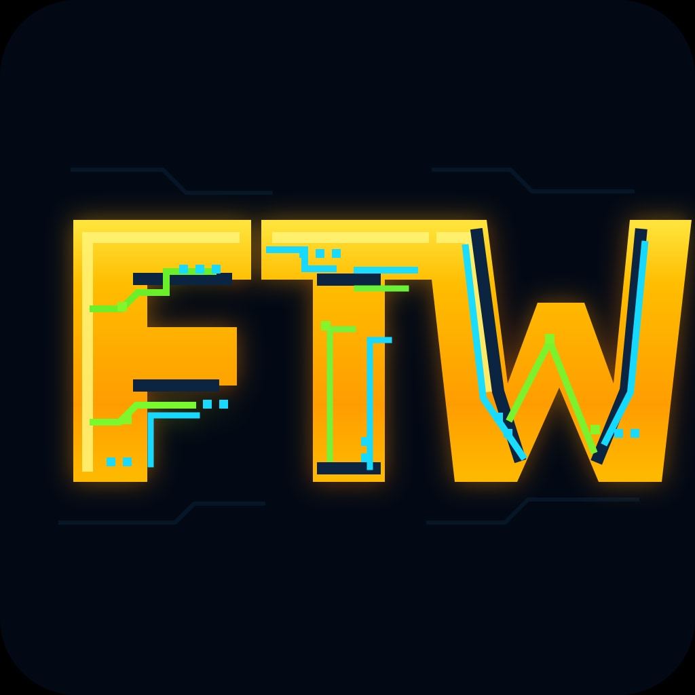

# forty-two-watts



> Local-first home energy management for solar, batteries, grid import,
> export, and EV charging.

forty-two-watts is a single Go binary that runs on a Raspberry Pi or any
Linux host. It coordinates inverters, batteries, meters, EV chargers, and
V2X devices through Lua drivers and keeps all core control local to the
site.

The project is active and runs on real hardware, but API and config fields
can still change before a stable 1.0 release. Version numbers come from
git tags and `package.json`; use the GitHub releases page for the latest
published build.

## What It Does

- **Self-consumption**: batteries discharge to cover household load, charge
  from PV surplus, and keep the site meter near the configured target.
- **MPC planning**: a 48-hour planner uses spot prices, weather, PV, load,
  and battery state to choose charge, discharge, hold, or export targets.
- **EV and V2X awareness**: EV charging is treated as load, and V2X chargers
  can emit bidirectional vehicle power without confusing stationary batteries.
- **Multi-device control**: multiple meters, inverters, batteries, PV-only
  devices, and chargers can run side by side.
- **Local operation**: the control loop does not depend on a cloud service.
  Prices, weather, notifications, and cloud drivers degrade independently.

## Supported Devices

Drivers are plain Lua files under [`drivers/`](drivers/). The in-app catalog
is generated from each driver's `DRIVER` metadata block, and
[`docs/driver-catalog.md`](docs/driver-catalog.md) mirrors that metadata for
humans. The driver list should not be maintained as a number in this README.

Current bundled driver families include:

| Category | Examples |
|---|---|
| Hybrid inverters | Sungrow, Ferroamp, Solis, Huawei, Deye, SMA, Fronius, GoodWe, Growatt, Sofar, Victron, Kostal |
| PV and meters | SolarEdge, SMA PV, Pixii PV, Eastron SDM630, Fronius Smart Meter, Tibber Pulse, Zuidwijk P1, Sourceful Zap |
| Batteries | Ferroamp, Pixii, sonnen, hybrid inverter batteries |
| EV and V2X | Easee, CTEK Chargestorm, Tesla Vehicle, Ferroamp DC2 V2X, Ambibox V2X |

Adding a new device starts with
[`docs/writing-a-driver.md`](docs/writing-a-driver.md).

## Quick Start

### Option A: Raspberry Pi SD-card image

A pre-built `42w-rpi4-arm64-vX.Y.Z.img.xz` ships with releases. Flash it
with Raspberry Pi Imager or balenaEtcher, boot the Pi, and open
`http://42w.local/`. If Wi-Fi is not pre-configured, the image exposes a
`42w-setup` captive portal for onboarding.

Full walkthrough: [`docs/rpi-image.md`](docs/rpi-image.md).

### Option B: Docker installer

On Raspberry Pi OS, Debian, or Ubuntu:

```bash
curl -fsSL https://raw.githubusercontent.com/frahlg/forty-two-watts/master/scripts/install.sh | bash
```

Then open `http://<your-pi>:8080/setup`.

### Option C: Home Assistant OS add-on

If you run Home Assistant OS or HA Supervised, install the add-on from
[`erikarenhill/ha-addon-forty-two-watts`](https://github.com/erikarenhill/ha-addon-forty-two-watts).

### Option D: Build from source

Prerequisites: Go 1.26+, a Linux/Raspberry Pi target, and at least one
supported device or simulator.

```bash
git clone https://github.com/frahlg/forty-two-watts
cd forty-two-watts

make dev          # simulators + app at http://localhost:8080
make test         # unit + integration tests
make build-arm64  # cross-compile for Raspberry Pi
```

Copy `config.example.yaml` to `config.yaml`, fill in your device
capabilities, and open the web UI.

## How It Works

```
config.yaml
    |
    v
Lua drivers: Modbus / MQTT / HTTP / WebSocket / raw TCP
    |
    v
Telemetry store: latest readings, driver health, metric queue
    |
    v
Control loop: PI, dispatch splitting, slew, fuse guard, watchdog
    |
    v
MPC planner + PV/load/price twins + SQLite state
    |
    v
HTTP API, dashboard, Home Assistant bridge, notifications
```

All power values above the driver boundary use the same site convention:
positive W means energy flowing into the site across the grid-meter
boundary. Read [`docs/site-convention.md`](docs/site-convention.md) before
touching power math.

## Documentation

**Get started**

- [`docs/rpi-image.md`](docs/rpi-image.md) - SD-card image and captive portal
- [`docs/setup-guide/`](docs/setup-guide/) - first-time setup wizard
- [`docs/configuration.md`](docs/configuration.md) - YAML config reference
- [`docs/driver-catalog.md`](docs/driver-catalog.md) - bundled Lua drivers

**Run it**

- [`docs/operations.md`](docs/operations.md) - deploy, backup, logs, recovery
- [`docs/self-update.md`](docs/self-update.md) - Docker updater sidecar
- [`docs/ha-integration.md`](docs/ha-integration.md) - MQTT autodiscovery
- [`docs/safety.md`](docs/safety.md) - watchdog, clamps, fuse guard

**Understand it**

- [`docs/architecture.md`](docs/architecture.md) - system map and data flow
- [`docs/site-convention.md`](docs/site-convention.md) - sign convention
- [`docs/ml-models.md`](docs/ml-models.md) - PV, load, and price twins
- [`docs/mpc-planner.md`](docs/mpc-planner.md) - planner strategy details
- [`docs/battery-models.md`](docs/battery-models.md) - ARX/RLS battery models
- [`docs/api.md`](docs/api.md) - HTTP API reference

**Build with it**

- [`docs/writing-a-driver.md`](docs/writing-a-driver.md) - Lua driver guide
- [`docs/host-api.md`](docs/host-api.md) - `host.*` Lua capability reference
- [`docs/testing-drivers-live.md`](docs/testing-drivers-live.md) - live driver testing
- [`docs/testing.md`](docs/testing.md) - repo test guide
- [`docs/development.md`](docs/development.md) - local development loop

Historical plans and early TODOs live under [`docs/archive/`](docs/archive/)
when they are kept for context.

## Development

```bash
make test
make e2e
make dev
make ci
make build-arm64
```

Releases are driven by Changesets and GitHub Actions. Do not hand-edit
`CHANGELOG.md` or manually bump `package.json`; pending release notes live
in `.changeset/*.md`.

## Community

- Discord: [discord.gg/z7FxpQnk](https://discord.gg/z7FxpQnk)
- Issues: [github.com/frahlg/forty-two-watts/issues](https://github.com/frahlg/forty-two-watts/issues)

## License

MIT
