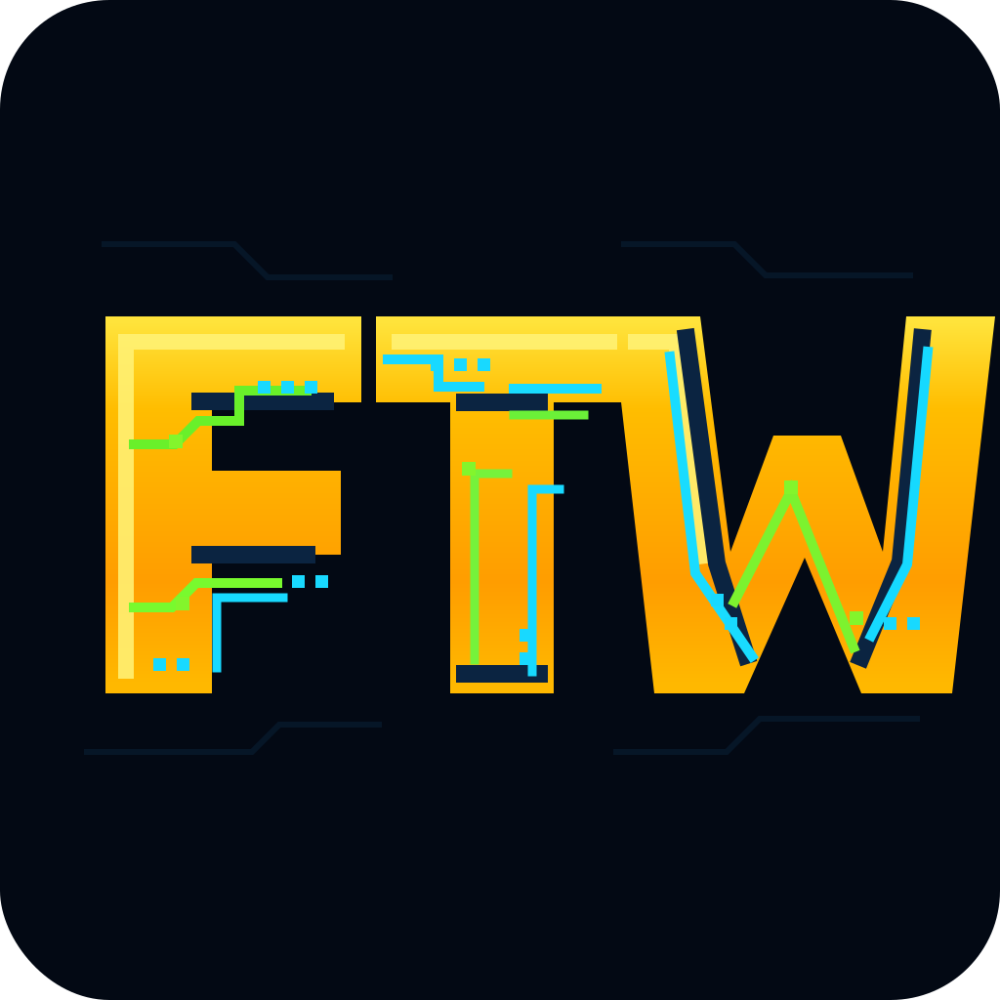

# FTW



> Local-first home energy coordination.

FTW coordinates solar, batteries, grid power, EV charging and thermal assets
on a Raspberry Pi or Linux host. The safety-critical runtime is one Go binary,
hardware integrations are sandboxed Lua drivers, and an optional Python/CVXPY
optimizer handles long-horizon planning.

The control path stays on the local network. Cloud price, weather and device
integrations degrade independently; they are not required for safe local
operation.

FTW Community is Apache-2.0 software maintained by Sourceful Energy and project
contributors. Community help is best effort. See [SUPPORT.md](SUPPORT.md) for
the boundary between community use and separate commercial services.

## Architecture

FTW has three explicit modules:

- **Core** owns configuration, telemetry, state, safety, dispatch, API and UI.
- **Drivers** translate vendor protocols and power signs in isolated Lua VMs.
- **Optimizer** proposes plans over a versioned contract; core validates every
  result and keeps a Go fallback.

This separation lets drivers and the optimizer evolve independently without
moving safety authority out of core. New module types should follow the same
rule. See [docs/architecture.md](docs/architecture.md).

## Capabilities

- self-consumption, peak shaving and explicit grid targets;
- multi-battery allocation with fuse, SoC, slew and stale-data protection;
- price-, weather-, PV- and load-aware planning;
- EV charging, V2X and thermal planning;
- local web UI, SQLite history and Parquet rolloff;
- Home Assistant MQTT discovery;
- CalDAV planning intents and published schedules;
- hot-reloadable, independently released Lua drivers.

The local catalog is generated from `DRIVER` metadata. Device Support owns
canonical Sourceful driver versions and signed target artifacts; the
[`drivers/*.lua`](drivers/) tree remains FTW's bundled, offline recovery set.

## Install on Linux

The installer supports Raspberry Pi OS, Debian and Ubuntu:

```bash
curl -fsSL https://raw.githubusercontent.com/srcfl/ftw/master/scripts/install.sh | bash
```

It installs Docker when needed, creates `~/ftw`, downloads the Compose file
and starts core, optimizer, updater and the local MQTT broker. Open
`http://<host>:8080/setup` on the LAN.

Existing Forty Two Watts or older FTW deployments must use the
[legacy upgrade guide](docs/upgrade-from-legacy.md) so configuration and state
are preserved. Raspberry Pi image installation is covered by
[docs/rpi-image.md](docs/rpi-image.md).

The dashboard is intentionally local. Use a VPN or another operator-managed
private network when access is needed away from home; FTW does not ship a
public relay.

## Local development

Requirements are Go, Python 3 and Node.js. The optimizer environment is cached
after its first install.

```bash
git clone https://github.com/srcfl/ftw.git
cd ftw
make dev
```

Useful checks:

```bash
make test      # Go + Python, parallel where independent
npm test       # web
make verify    # fast test, compose, vet and build checks
make e2e       # simulator-backed full stack
make ci        # e2e, builds and browser smoke
```

See [docs/development.md](docs/development.md) for the small set of development
workflows.

## Configuration

`config.example.yaml` and the validation types in `go/internal/config` are
the configuration reference. Copy the example for a native development setup:

```bash
cp config.local.example.yaml config.local.yaml
```

Power values above a driver use one convention: positive means into the site,
negative means out. Drivers alone translate vendor conventions. Read
[docs/site-convention.md](docs/site-convention.md) before editing power math or
writing a driver.

## Drivers

Drivers are plain Lua files and need no compilation. A driver declares its
catalog metadata, lifecycle and required capabilities in one file. The Go host
provides capability-scoped Modbus, MQTT, HTTP, WebSocket and TCP access.

Start with [docs/writing-a-driver.md](docs/writing-a-driver.md). Signed driver
artifacts are published once by Device Support, selected for FTW's explicit
GopherLua target, and can be installed or rolled back independently.

## Releases

There are two channels:

- **beta** receives new release candidates for real-site validation;
- **stable** promotes the exact commit already published and tested as beta.

There is no edge channel. Changesets produce versions and changelog entries;
GitHub Actions builds the binaries, containers and installer assets. Details
for operators and maintainers are in [docs/self-update.md](docs/self-update.md).

## Documentation

The repository deliberately keeps prose small. Code, types, tests and driver
metadata are the detailed reference.

- [Architecture](docs/architecture.md)
- [Power sign convention](docs/site-convention.md)
- [Safety invariants](docs/safety.md)
- [Operations and recovery](docs/operations.md)
- [Full backup and safe restore](docs/backup-and-restore.md)
- [Writing a driver](docs/writing-a-driver.md)
- [Self-update and release channels](docs/self-update.md)
- [Home Assistant](docs/ha-integration.md)
- [CalDAV](docs/caldav-integration.md)

Other files under `docs/` are focused installation or external-integration
guides.

## Contributing

Read [CONTRIBUTING.md](CONTRIBUTING.md). User-visible changes need a Changeset.

Apache-2.0 — see [LICENSE](LICENSE).
