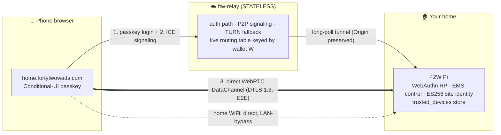
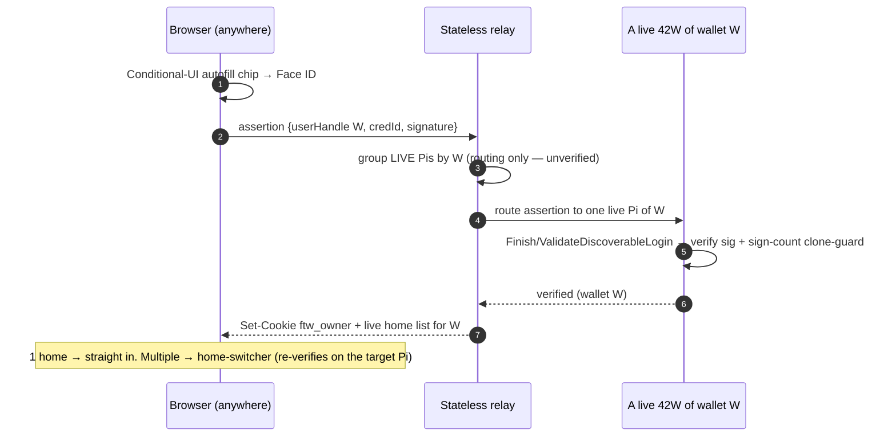

# `home.fortytwowatts.com` — Passkey-gated remote home access (v1 design)

- **Date:** 2026-06-03
- **Status:** Approved (brainstorm) → ready for implementation plan
- **Branch context:** builds on `relay-mcp-grant` (owner-access WebAuthn RP, grant-exchange auth, ftw-relay tunnel already in tree)
- **Related:** `docs/relay-deploy.md`, `docs/nova-integration.md`, `go/internal/api/api_owner_access.go`, `go/cmd/ftw-relay`, `go/internal/tunnel`

---

## 1. One-liner

A stateless cloud pipe connects a homeowner's phone browser to **their own** Raspberry Pi. The passkey **is** the wallet. The Pi verifies the passkey and owns the data. Once authenticated, the connection goes **direct peer-to-peer and end-to-end encrypted**; the cloud sees only ciphertext (or nothing).

> Your home has one URL. Your passkey is the key.

This is **validate-and-refine, not greenfield** — ~70% already exists on this branch. The work is *wire-up + harden + add P2P*.

---

## 2. Goals / non-goals

**Goals (v1)**
- One global URL (`home.fortytwowatts.com`), **no username typed**, passkey (Face ID / Touch ID / Windows Hello) → live EMS.
- **One person → several homes** (the `WALLET → SITE` tier): one home opens directly; multiple → a selector.
- **Local-over-cloud preserved:** on home WiFi the cloud is never involved; the cloud path is opt-in remote access only.
- **Relay stays a dumb, stateless byte-pipe** that holds no credential, no plaintext, no persistent directory.
- After auth, **direct P2P (WebRTC DataChannel, DTLS-E2E)**, auto-upgrading to **WebTransport/QUIC** where the Pi is reachable.

**Non-goals (v1)** — see §11.
- A real wallet *keypair* / on-chain value flow (the `userHandle` upgrade path).
- A native QUIC-P2P mobile app (`go-libp2p` DCUtR) — same relay + Pi endpoint, zero rework when wanted.
- Unifying the friend-delegation flow into `home.*` (kept separate and untouched).
- Pi-terminated TLS / SniTun (the WebRTC DataChannel already makes data E2E; SniTun becomes unnecessary for the owner path).

---

## 3. Locked decisions

| # | Decision | Choice | Why |
|---|---|---|---|
| D1 | v1 scope | **Account + multi-home** (the `WALLET` tier) | "One person, many homes" = `WALLET → SITE`, the hierarchy the code never implemented |
| D2 | Site identity | **Self-sovereign ES256 on every Pi, Nova-format, Nova-independent** | Compliant, never dependent; promote `nova/identity.go` to always-on |
| D3 | Relay | **Stateless router + signaling broker + encrypted fallback** | Live routing table, not a DB; offline Pi = unreachable = "doesn't exist" |
| D4 | WebAuthn RP | **On the Pi**; relay routes (unverified) → Pi verifies | Credentials + authz decision never leave the home |
| D5 | Wallet identity | **Stable shared WebAuthn `userHandle` (W)** | Passkey *is* the wallet; reused across passkeys + Pis; propagated peer-to-peer at claim/enroll |
| D6 | RP-ID | **`home.fortytwowatts.com`** (dedicated host, never apex) | Standing rule **and** correct WebAuthn scope; **immutable once passkeys exist** — pin in ADR |
| D7 | Login mediation | **Discoverable resident-key + Conditional-UI autofill**, one-tap modal fallback | True no-username UX; ~95–98% device coverage |
| D8 | Transport (v1) | **Browser-only: WebRTC DataChannel (DTLS-E2E)**, QUIC where reachable | Honors "just a URL, no install"; E2E even on fallback |

---

## 4. Identity model

- **Site identity** — every 42W generates an **ES256 (P-256) keypair on first boot, unconditionally**, in Nova-Core's exact format (`go/internal/nova/identity.go` `LoadOrCreateIdentity`, today gated on Nova being enabled → promote to always-on). Nova federation, if later enabled, reuses the same key.
- **Wallet identity** — a stable opaque **WebAuthn `userHandle` (W)** minted at first enrollment. Multiple credentials (passkeys) share one `userHandle`; multiple Pis store the same `W`. The relay groups live Pis by `W`. There is **no separate wallet keypair** in v1 (upgrade path in §11).
- **RP-ID** — `home.fortytwowatts.com`. Per the registrable-domain-suffix rule, a host is trivially a suffix of its own origin; this keeps the credential **off the apex** and out of sibling-subdomain reach. **One-way door**: changing RP-ID later invalidates every passkey. Pin in an ADR next to the site-convention invariants. Do **not** enroll real owner passkeys under `relay.*` first.

> Today `api_owner_access.go` keys the single synthetic owner on `WebAuthnID = "site:"+Site.Name`. v1 replaces that with the stable opaque `W` (decoupled from the mutable site name, so renames and name-collisions can't orphan passkeys or cross-wire two "Home"s).

---

## 5. Architecture



The relay, if compromised, can **DoS but cannot forge a session, read plaintext, or recover a credential**.

---

## 6. Flows

### 6.1 Claim a home (first enrollment — you're physically there)

```mermaid
sequenceDiagram
  autonumber
  participant B as Browser (home WiFi)
  participant R as Stateless relay
  participant Pi as Your 42W (RP)
  Pi->>R: announce {site_id, wallet W?} on live tunnel
  B->>R: GET home.fortytwowatts.com
  R->>Pi: route (long-poll tunnel)
  Pi-->>B: no owner yet → require proof of local presence
  Note over B,Pi: 4-digit code shown ONLY on LAN dashboard (reuse pair-code pattern)
  B->>Pi: submit code  (origin = home.fortytwowatts.com, RP-ID = home.fortytwowatts.com)
  B->>Pi: navigator.credentials.create() → new passkey
  Pi->>Pi: first passkey → mint W; additional Pi → reuse W (from session); store cred in trusted_devices(+wallet_handle)
  Pi-->>B: prompt "add a 2nd passkey" + print one-time recovery code
  Pi->>R: announce {site_id, wallet W}
```

**Key constraint:** a passkey usable at `home.fortytwowatts.com` must be **created with origin `https://home.fortytwowatts.com`** (WebAuthn won't run on `http://192.168.x.x` — no secure context). So presence is proven *locally* (LAN code), but the *ceremony origin* is the central host, routed through the relay back to the user's own Pi.

### 6.2 Sign in from anywhere



Privacy: the relay reveals the home list **only after** one Pi has verified the assertion (an unverified `userHandle` is used for routing only, never to disclose home ownership).

### 6.3 Steady-state — efficient, modern, private

```mermaid
sequenceDiagram
  autonumber
  participant B as Browser
  participant R as Relay (signaling)
  participant Pi as 42W
  B->>R: SDP offer + ICE candidates (STUN)
  R->>Pi: forward (signaling only)
  Pi->>R: SDP answer + ICE
  R->>B: forward
  B-->>Pi: direct WebRTC DataChannel (DTLS 1.3, E2E)
  Note over B,Pi: dashboard traffic now bypasses the relay data path
  Note over B,Pi: auto-upgrade to WebTransport/QUIC when Pi directly reachable (IPv6 / opened port)
  Note over B,R,Pi: hard-NAT both sides → TURN relay fallback (ciphertext only)
```

On home WiFi, all of the above is skipped: the browser hits the Pi directly and LAN-bypass applies.

---

## 7. Component inventory — reuse vs build

### Reuse as-is (refine, don't rewrite)
- `go/internal/api/api_owner_access.go` — enroll/login/session ceremony, `ftw_owner` cookie (`issueOwnerSession`), `authorizeOwner`, `isLoopback`.
- `go/internal/state/trusted_devices.go` — passkey store (`CredentialID` PK, `PublicKey`, `SignCount`, `AAGUID`, `Transports`) + monotonic clone-guard. **Extend:** add `wallet_handle` + store `CredentialFlags.ProtocolValue()` (backup-eligible/UV) for full spec compliance.
- `go/cmd/ftw-relay` owner-route family (`handlers.go` `meRoot`/`meTunnel`/`meForward`, `owners.go` `OwnerRegistry`) + `go/internal/tunnel` (`protocol.go` preserves full `http.Header` verbatim — the property that makes Pi-as-RP work behind NAT).
- `go/cmd/forty-two-watts/owner_relay_register.go` — Pi self-registration + reverse-proxy to `127.0.0.1:8080` (transport swaps underneath).
- `go/internal/nova/identity.go` + `jwt.go` — ES256 primitives (promote site identity to always-on).
- The existing 4-digit pair-code ceremony (`go/cmd/ftw-relay/tokens.go`) — reused for the LAN presence proof.
- `web/owner-access/{index,login,enroll}.html` + `webauthn.js` (`apiBase()` is already relay-prefix-aware; DESIGN-compliant, no Google Fonts).

### Build new (all pure-Go — honors "No CGo anywhere")
1. **Global auth-gate middleware** on the Pi (§8.1).
2. **Tunnel-origin marker** so relay-tunneled requests can't inherit LAN-bypass (§8.2).
3. **Wallet `userHandle` grouping + claim handshake** (propagate `W` peer-to-peer; relay announce carries `W`).
4. **Discoverable login** — switch to `BeginDiscoverableLogin` / `ValidateDiscoverableLogin` keyed on `W`; Conditional-UI front-end + modal fallback.
5. **WebRTC DataChannel** (`pion/webrtc`) + **WebTransport/QUIC** (`quic-go` / `webtransport-go`) on the Pi, with a **fetch-over-DataChannel shim** in the browser that replays HTTP against the local mux (reusing the existing reverse-proxy semantics).
6. **Relay**: P2P signaling broker (ephemeral), STUN config + TURN fallback, wildcard `*.fortytwowatts.com` → wallet/site routing, live wallet→[site] table.
7. **RP-ID reconfig** + ADR; **multi-home selector** UI.
8. **Recovery**: 2nd-passkey prompt + one-time recovery code (§9).

---

## 8. Security must-fixes (ship in the **same** PR as the route)

### 8.1 Global auth-gate on the Pi
Today `authorizeOwner` gates only 4 owner-access endpoints; `handleStatic` (`api.go:337`, `/` → dashboard) and **every `/api/*` control endpoint are ungated**. A `home.*` URL pointed at this tunnels straight to a wide-open dashboard that controls **real power hardware**. Add middleware wrapping the whole mux (static `/` + `/api/*`); an unauthenticated **remote** hit redirects to the passkey login.

### 8.2 Tunnel-vs-LAN disambiguation
`isLoopback` keys LAN-bypass on a loopback `r.Host`, but relay-tunneled requests arrive at `127.0.0.1:8080` via the reverse proxy and look identical. **Without a forge-proof signal, every remote request silently inherits LAN-bypass = total auth bypass.** Fix: `runOwnerLongPoll` sets a trusted `X-FTW-Tunnel` header on proxied requests; the gate strips that header from genuinely-inbound traffic first (so it can't be injected) and treats its presence as "remote → must pass passkey."

### 8.3 Bootstrap hardening
`enrollAllowed` returns nil when zero devices exist (trust-on-first-use). Through the relay that first-enrollment window is internet-exposed — first to reach `enroll/start` becomes owner. Gate first enrollment behind LAN/physical presence (the `isLoopback` path) **or** the 4-digit pair code.

---

## 9. Recovery & multi-passkey

- Prompt **"add a second passkey"** immediately after first login (synced passkeys raise completion to 40–60% vs 15–30% for device-bound-only).
- Print a **one-time recovery code** at setup (the only non-passkey escape; never SMS/email-OTP — that reintroduces the phishable channel passkeys remove).
- **On-site LAN-bypass** remains the always-available local recovery path.
- Steer the platform picker with WebAuthn `hints` (`client-device` for Face ID, `hybrid` for the QR cross-device flow). Tell the user *where* the passkey is saved at enrollment (one line prevents most "where did my passkey go" tickets).

---

## 10. Transport detail

- **Primary:** WebRTC DataChannel — ICE/STUN NAT traversal, **DTLS 1.3 E2E**. `pion/webrtc` on the Pi (pure Go).
- **Upgrade:** WebTransport over HTTP/3 (`quic-go` + `webtransport-go`) when the Pi is directly reachable (IPv6 / UPnP / opened port) — real QUIC, no NAT traversal needed there.
- **Fallback:** TURN relay (still WebRTC, **ciphertext only**) or the existing long-poll request-response tunnel.
- **Signaling:** SDP/ICE exchange rides the stateless relay (ephemeral, post-auth only).
- **Future native app:** `go-libp2p` (QUIC + DCUtR hole-punching) — true QUIC P2P, shares the same relay-signaling and Pi endpoint.

---

## 11. Out of scope (v1) — flagged, not forgotten

- **Wallet keypair + value-flow signing** — `W` (a `userHandle`) upgrades to a real ES256 wallet keypair later **without re-enrollment** (W stays the stable anchor).
- **Native QUIC-P2P app** — same relay + Pi endpoint.
- **Friend-delegation unification** — the `/h/<token>` grant flow (4-digit-code → grant, MCP-first) stays separate and untouched. `home.*` is owner/wallet login only. *(Defaulted; revisit if explicitly wanted.)*
- **Pi-terminated TLS / SniTun** — unnecessary once the DataChannel is E2E.
- **Per-person identity within one home** (family members) — would be discoverable login with distinct `userHandle`s; retrofit-after-enrollment is painful, so flag as a future crossroads.

---

## 12. Risks & ops

- **R1 — wide-open dashboard until §8.1 lands.** The gate and the route MUST ship together; the EMS controls real power hardware.
- **R2 — LAN-bypass leaking to tunneled requests (§8.2).** A complete auth bypass if the tunnel-origin signal isn't forge-proof. Needs a dedicated test.
- **R3 — RP-ID is a one-way door.** Wrong/changed RP-ID bricks every passkey. Pin `home.fortytwowatts.com` once; never enroll real passkeys under `relay.*` first.
- **R4 — `site:"+Name` collisions / rename-orphaning.** Two default-"Home" testers cross-wire. Stable opaque `W` + per-site id is mandatory before any field enrollment.
- **R5 — total-device-loss lockout.** Mitigated by §9 (2nd passkey + recovery code + LAN).
- **R6 — TURN is a real ops cost.** WebRTC fallback requires running/operating a TURN server (one research agent counseled against P2P for exactly this). Accepted: the E2E property is worth it, and TURN carries ciphertext only. Budget for a coturn deployment alongside the relay.
- **R7 — relay learns `wallet → [site]` from live announcements (cleartext).** Acceptable for v1 (relay is Sourceful-operated); note rotating/salted announcement tokens as later hardening.
- **R8 — `signCount == 0` is normal** for synced passkeys; the clone-guard must reject only a *decrease* from a previously-positive value, never `0→0`. Needs a regression test.

---

## 13. Defaulted open items (object during spec review to change)

- **CSRF:** most mutating traffic now rides the E2E DataChannel (not cookie-bearing cross-site), shrinking the surface. Spec `SameSite=Lax` + explicit CSRF tokens on the residual cookie-borne mutating `/api/*`.
- **Sessions:** keep in-memory (`authSessions`); re-login is one tap. Note a `sessions` table mirroring `trusted_devices` as an optional robustness follow-up.
- **`ACAO:*`** (`writeJSON`, `api.go:356`) is incompatible with cookie-credentialed cross-origin — the same-origin-via-relay design avoids it; keep it a same-origin path.

---

## 14. Phasing (maps to the implementation plan)

1. **Safe floor (security must-fixes).** Global auth-gate (§8.1) + tunnel-origin marker (§8.2) + bootstrap hardening (§8.3) + RP-ID config + tests. *Shippable, makes the existing `/me/<site>` path safe immediately.*
2. **Identity spine.** Always-on ES256 site identity; stable opaque `W` + per-site id; `trusted_devices.wallet_handle`; migrate owner identity off `"site:"+Name`.
3. **Usernameless login.** Discoverable login + Conditional-UI front-end + modal fallback; recovery (§9).
4. **Multi-home (the wallet tier).** `W` propagation at claim/enroll; relay live wallet→[site] table; home selector + switcher; `home.fortytwowatts.com` host + wildcard routing + TLS.
5. **P2P transport.** `pion/webrtc` DataChannel + fetch-over-DataChannel shim; STUN/TURN; WebTransport/QUIC upgrade.

Each phase is independently valuable and testable; phase 1 is the must-ship floor.

---

## 15. Test strategy

- Origin acceptance: `home.fortytwowatts.com` accepted, wrong origin rejected (extend `api_owner_access_test.go`).
- **Auth-bypass regression:** a relay-tunneled request must NOT inherit LAN-bypass (§8.2) — the highest-value test in the whole feature.
- Clone-guard: `signCount` constant-zero is benign; a decrease is rejected.
- Wallet grouping: two Pis sharing `W` resolve to one selector; two default-"Home" sites do **not** cross-wire.
- E2E (`go/test/e2e`): full claim → sign-in → DataChannel round-trip against sims.

---

## References

- RP-ID deep dive — https://web.dev/articles/webauthn-rp-id
- Discoverable credentials — https://web.dev/articles/webauthn-discoverable-credentials
- Related Origin Requests — https://web.dev/articles/webauthn-related-origin-requests
- Conditional UI explainer (W3C) — https://github.com/w3c/webauthn/wiki/Explainer:-WebAuthn-Conditional-UI
- go-webauthn API — https://pkg.go.dev/github.com/go-webauthn/webauthn/webauthn
- pion/webrtc — https://github.com/pion/webrtc
- quic-go / webtransport-go — https://github.com/quic-go/webtransport-go
- Nabu Casa Remote UI / SniTun (the comparison we consciously did not pick) — https://www.nabucasa.com/config/remote/ , https://github.com/NabuCasa/snitun
