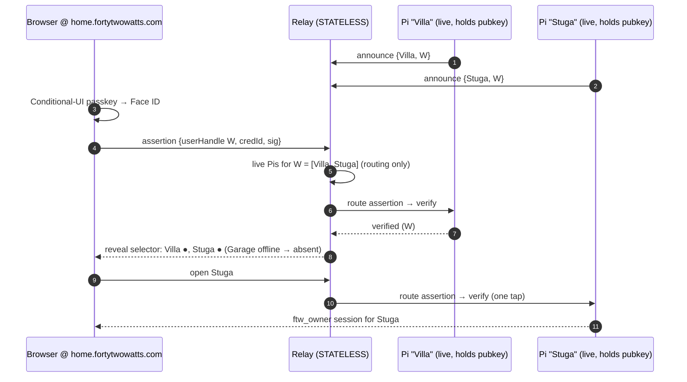
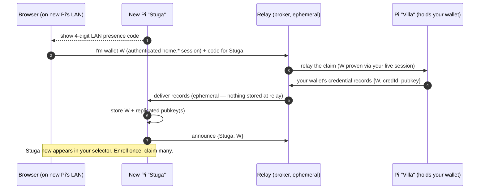

# Home Route — Phase 4: Multi-home on a stateless relay — Design

- **Date:** 2026-06-03
- **Status:** Design approved (brainstorm). **Implementation deferred** — this is a design doc, not a build plan. Write the bite-sized plan (`writing-plans`) when ready to code.
- **Builds on:** Phases 1–3 (`home-route-phase1`), spec `docs/superpowers/specs/2026-06-03-home-route-passkey-design.md`, ADR `docs/adr/0001-passkey-rp-id.md`.

## One-liner

One usernameless login at `home.fortytwowatts.com` resolves a *person* (wallet `W`) to **all their currently-online homes** — with the relay still a **pure stateless byte-pipe**: it routes by wallet to whichever Pis are connected, each Pi verifies the passkey itself, and an offline Pi simply isn't in the list.

## Approved decisions

| # | Decision | Choice | Rationale |
|---|---|---|---|
| P4-1 | Multi-home auth | **One tap per home** — each Pi verifies the passkey itself | Relay stays a dumb pipe; no central session anything could forge; no Pi impersonates another. Opening N homes = N taps (rare). |
| P4-2 | Claim model | **One passkey, public key replicated to each claimed Pi** | *Forced* by P4-1: the relay routes by wallet to any live Pi, so every Pi must be able to verify the one passkey → every Pi holds its pubkey. A per-Pi-passkey scheme would need a credential→Pi map = relay state = rejected. |
| P4-3 | Host | **Single `home.fortytwowatts.com`** (no per-home subdomains, no wildcard cert) | One host, one TLS cert; one RP-ID serving every homeowner. Per-home subdomains are a passkey anti-pattern (each is its own RP scope). |
| P4-4 | RP-ID cutover | `relay.*` → **`home.fortytwowatts.com`** | The ADR's one-way door. Clean because no *real* passkeys exist under `relay.*` (Phases 1–3 were hardening; this is where production enrollment begins). |
| P4-5 | Relay role | **Stateless `home.*` surface**: serve login page · route assertion by wallet · assemble selector from live announces · route to chosen Pi | Live routing table (who's connected now), never a persistent directory. |

## How multi-home works without relay state

Each Pi, on opening its tunnel to the relay, **announces `{site_label, wallet W}`** (it knows `W` once a passkey is enrolled — the Phase-2 handle). The relay holds these announces only as **live connection metadata** (gone when the Pi disconnects). To resolve a person → homes:

1. The browser's assertion carries `userHandle = W`.
2. The relay groups its live Pis by `W` (routing only — unverified).
3. It routes the assertion to one live Pi of `W`, which **verifies** (it holds the replicated pubkey).
4. **Only after** one verification does the relay reveal `W`'s live homes (privacy: an unverified `userHandle` never discloses ownership).
5. The selector lists those homes; opening any one runs that Pi's own verification (P4-1).

### Flow A — sign in, multi-home

### Flow B — claim a 2nd/3rd home (replicate the passkey)

## What's reused vs new

**Reused (Phases 1–3):** Pi-as-RP + discoverable login (`resolveDiscoverableOwner` keyed on `W`), the wallet handle `W` + `trusted_devices` (extend to store *replicated* credentials, not just locally-enrolled), the auth-gate + tunnel marker, the long-poll tunnel transport, the Conditional-UI login page.

**New (Phase 4):**
1. **Relay `home.fortytwowatts.com` vhost** — login surface + the wallet-routing logic + selector assembly. Stateless (live announce table).
2. **Pi → relay announce protocol** — `{site_label, wallet W}` on tunnel connect (extend the existing `/me/register`).
3. **Verify-then-reveal** — relay routes assertion to a live Pi, gets a verify result, then returns the wallet's live-home list.
4. **Claim handshake** — LAN presence + wallet proof → Pi-to-Pi credential replication, relay-brokered + ephemeral.
5. **RP-ID cutover** — default → `home.fortytwowatts.com`; serve enrollment from that origin; DNS A-record + single TLS cert.
6. **Selector UI** — the live-homes list (extends `web/owner-access/index.html`).

## Open implementation questions (resolve in the Phase-4 plan)

- Exact wire format for the announce + the verify-then-reveal round trip over the existing tunnel protocol.
- Whether replicated credentials live in `trusted_devices` with an `origin` flag (locally-enrolled vs replicated-from-claim) — likely yes, for auditing + revoke.
- Revocation: removing a wallet from a Pi (un-claim) and propagating a credential removal across your Pis (best-effort; offline Pis reconcile on reconnect).
- The relay-brokered ephemeral channel for the claim transfer (a one-shot, authenticated, non-persisted message Pi→Pi).
- TLS/DNS provisioning for `home.fortytwowatts.com` (Caddy/Let's Encrypt on the relay VM).

## Risks

- **RP-ID cutover is the one-way door** — enrolling real passkeys begins here under `home.*`; never enroll real ones under `relay.*` first (ADR).
- **Claim replication is the new trust-sensitive path** — it must require *both* LAN presence at the new Pi *and* a verified wallet session; neither alone.
- **Stale announces** — a Pi that crashes without closing its tunnel could linger in the live table until the relay's connection times out; the selector must reflect real liveness (heartbeat/timeout), or a dead home shows then 503s.
- **One-tap-per-home friction** — acceptable per P4-1, but document it so it reads as a deliberate security property, not a bug.

## Out of scope (later phases)

- **Transport** — WebRTC/QUIC P2P is Phase 5; Phase 4 rides the existing long-poll tunnel.
- **A real wallet *keypair*** (value-flow signing) — `W` stays a `userHandle`; upgradeable later without re-enrollment.
